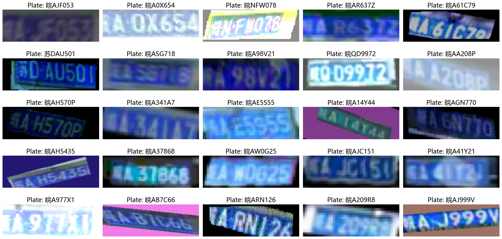
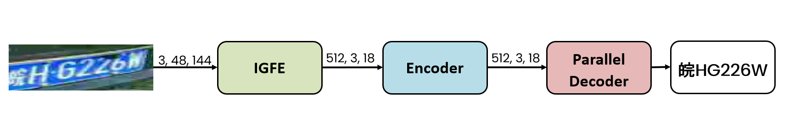

# YOLOv5-PDLPR algorithm

## Task
The objective of this project is to design and implement a deep learning-based system for license plate recognition, following the methodology outlined by [Tao et al.](https://www.mdpi.com/1424-8220/24/9/2791) (2024). The proposed solution is structured as a two-stage pipeline, leveraging the strengths of different neural network architectures to address the distinct subtasks involved in the recognition process.

- In the **first stage**, a **YOLOv5** model is employed for license plate detection, allowing for fast and accurate localization of the plate region within vehicle images, even under challenging environmental conditions.

- In the **second stage**, the cropped plate region is passed to a specialized recognition model based on the **PDLPR** architecture. This model is responsible for decoding the sequence of alphanumeric characters on the plate, effectively treating the task as a sequence prediction problem.

The integration of these two components aims to deliver a robust and efficient system for plate recognition and reconstruction suitable for deployment in real-world scenarios.


## Main Objectives

- Implement a simple baseline, train and evaluate it with the metrics used by [Tao et al.](https://www.mdpi.com/1424-8220/24/9/2791) (2024).

- Implement the proposed model by [Tao et al.](https://www.mdpi.com/1424-8220/24/9/2791) (2024), composed of the YOLOv5 and PDLPR models, and evaluate it.

- Compare the performance of the proposed model with the baseline, underlining why the proposed model works better or not on recognizing and reconstructing the car plates.


## Project Structure
```
PDLPR-algorithm/
├── src/                         # Core source code
│   ├── attention.py             # Self-attention and cross-attention modules
│   ├── augmentation.py          # Data augmentation transformations
│   ├── decoder.py               # Decoder module for the PDLPR architecture
│   ├── encoder.py               # Encoder module for the PDLPR architecture
│   ├── feature_extractor.py     # IGFE
│   ├── pdlpr.py                 # Main PDLPR model structure
│   ├── trainer.py               # Training and evaluation utilities
│   ├── utility.py               # Helper functions: decoding, dataset creation, etc.
│   └── README.md                # Documentation for PDLPR components
│
├── baseline_scr/                # Baseline source code
│   ├── detection/               # Baseline license plate detection
|   |   ├── model.py             # Module for the baseline detection architecture
|   |   └── trainer.py           # Training and evaluation utilities
|   |
│   ├── recognition/             # Baseline license plate recognizer (CNN + BiLSTM)
|   |   ├── module.py            # CNN + BiLSTM module for the baseline architecture
|   |   └── trainer_rec.py       # Training and evaluation utilities
|   |
│   └── README.md                # Documentation for baseline components
|
├── checkpoints/                 # Checkpoints of the trained models
|
├── presentation/                # Slides with results and analysis
|
├── figures/                     # Figures used in README and presentation
│
├── pdlpr-main.ipynb             # Notebook for training and evaluating PDLPR
├── inference-yolov5-pdlpr.ipynb # Notebook for evaluate YOLOv5+PDLPR
├── baseline-recognition.ipynb   # Notebook for training the baseline recognizer
└── README.md                    # Project overview and documentation
```

## Dataset

[CCPD](https://github.com/detectRecog/CCPD) (Chinese City Parking Dataset) is a large and diverse open-source dataset of Chinese license plates. Each image contains one license plate, and each plate includes seven characters:

- The **first character** represents a **provincial administrative region**.
- The **second character** is a **letter**.
- The **remaining five characters** are either **letters or numbers** (excluding the characters "I" and "O").

The dataset is divided into nine sub-datasets, each representing different challenges such as illumination, tilt, distance, and weather conditions. These are described below:

| Sub-Dataset        | Description |
|--------------------|-------------|
| **CCPD-Base**      | Standard images with the only shared feature being the presence of a license plate. |
| **CCPD-DB**        | Dark, uneven, or extremely bright illumination in the license plate (LP) area. |
| **CCPD-FN**        | Captured from varying distances — either relatively far or near. |
| **CCPD-Rotate**    | Large horizontal tilt (20°–50°) and vertical tilt from -10° to 10°. |
| **CCPD-Tilt**      | Extreme horizontal (15°–45°) and vertical tilt (15°–45°). |
| **CCPD-Blur**      | Blurry images, mostly due to hand jitter during capture. |
| **CCPD-Weather**   | Images taken in adverse weather: rain, snow, or fog. |
| **CCPD-Challenge** | The most difficult and complex images for license plate detection and recognition (LPDR). |
| **CCPD-NP**        | Images of new cars with no visible license plate. |


For model **training** and **validation** we considered only 50,000 randomly selected samples from the  CCPD-Base sub-dataset.
Six challenging sub-datasets of 1,000 samples were used for **evaluation**:
  -  CCPD-DB 
  -  CCPD-FN 
  -  CCPD-Rotate 
  -  CCPD-Tilt 
  -  CCPD-Weather 
  -  CCPD-Challenge 


## Data Augmentation
To address the limited size of the training set and to improve generalization across challenging test sub-datasets, we applied extensive **data augmentation**. This helps prevent overfitting and enhances the model’s robustness to various real-world conditions.

We designed **ad-hoc transformations** tailored to the characteristics of the different CCPD sub-datasets. The augmentations simulate conditions such as camera distortion, motion, lighting, and environmental effects. The applied transformations include:

- Affine transformations (rotation, shear, translation)
- Perspective distortion
- Gaussian blur
- Motion blur
- Color dithering
- Changes in contrast, saturation, and brightness
- Image quality degradation (e.g., compression artifacts)
- Simulated fog and nighttime conditions
- Other visual perturbations

The figure below illustrates examples of augmented license plate images for the recognition task:



## Baseline

**TODO**: Breve descriziomn della detection

The **baseline recognizer** uses a **CNN + BiLSTM + Linear** architecture to convert a license plate image into a sequence of character logits. A convolutional backbone extracts spatial features from input images of shape `[B, 3, 48, 144]`, producing a feature map of shape `[B, 256, 12, 36]`.
The width dimension is treated as the temporal axis and fed to a 2-layer **Bidirectional LSTM**. The model selects 7 fixed time steps to produce 7 character predictions, each mapped to one of 68 possible classes through a linear layer. Training is performed using **Cross Entropy Loss**.

## YOLOvs-PDLPR

### YOLOv5

[YOLOv5](https://github.com/ultralytics/yolov5) is a computer vision model developed by [Ultralytics](https://www.ultralytics.com/). We **fine-tuned** their pre-trained model using a two-phase training process:

1. **Warm-up phase:** We trained the model for 5 epochs with the `--freeze` parameter set to 10, using an initial learning rate of 0.001.
2. **Fine-tuning phase:** We then continued training for an additional 40 epochs, lowering the learning rate to 0.0005 and unfreezing the layers as needed.


### PDLPR

The PDLPR model architecture is illustrated in the figure below:

It comprises three primary modules:

1. **Improved Global Feature Extractor (IGFE)**  
   - Input: License plate images resized to `48 × 144` pixels.  
   - Process: Extracts features and converts them into a feature vector of dimensions `512 × 6 × 18`.  

2. **Encoder Module**  
   - **Position Encoder**: Encodes the position of the feature map and adds it to the image feature vector.  
   - **Multi-Head Attention**: Further encodes the combined vector to produce an output feature vector.  

3. **Parallel Decoder Module**  
   - Utilizes **Multi-Head Attention** to decode the encoder's output feature vector.  
   - Predicts the final license plate sequence.  

The training is performed using **CTC Loss**.

## Metrics

Since each image in the CCPD dataset contains only a **single license plate (LP)**, we focus on **accuracy** rather than recall. Each detector is allowed to predict **only one bounding box per image**.

The evaluation is divided into three parts:

- **Detection**:  For each image, the detector outputs a single bounding box. A detection is considered **correct** if the Intersection over Union (IoU) with the ground truth bounding box is greater than 70% (**IoU>0.7**)

 - **Recognition**: A recognition is considered correct only if **all characters** in the license plate are **correctly recognized**.

- **Combined Detection and Recognition**:  A result is considered fully correct when the predicted bounding box has **IoU > 0.6**, and **all characters** in the license plate are correctly recognized.


## Checkpoints

The trained model checkpoints for both the **PDLPR architecture** and the **baseline recognizer** are too large to be included directly in the repository. You can download them from [Google Drive](https://drive.google.com/drive/folders/1BcgfnjKgwZWvo-_ba3Pz2cMOwXfg_at8?usp=drive_link).


## Results


## References

1. Tao, L., Hong, S., Lin, Y., Chen, Y., He, P. and Tie, Z. (2024). [A Real-Time License Plate Detection and Recognition Model in Unconstrained Scenarios](https://www.mdpi.com/1424-8220/24/9/2791). *Sensors*, 24(9), 2791.


2. Xu, Z.; Yang, W.; Meng, A.; Lu, N.; Huang, H.; Ying, C.; Huang, L. [Towards end-to-end license plate detection and recognition: A large dataset and baseline](https://openaccess.thecvf.com/content_ECCV_2018/papers/Zhenbo_Xu_Towards_End-to-End_License_ECCV_2018_paper.pdf). In Proceedings of the European Conference on Computer Vision (ECCV), Munich, Germany, 8–14 September 2018.