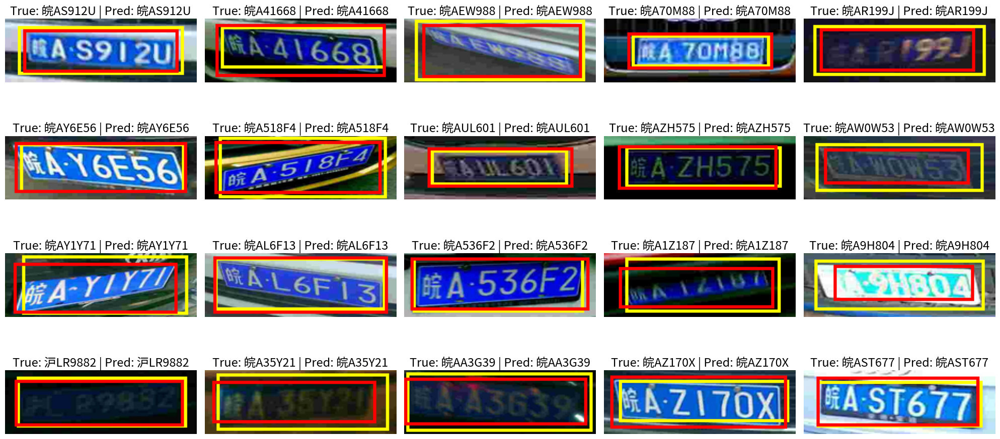

# YOLOv5-PDLPR algorithm

## Introduction

This repository contains the project developed for the **Computer Vision** course (A.A. 2024–2025) taught by *Irene Amerini*. The goal of the project is **vehicle license plate detection and recognition** using deep learning techniques.

The contributors to this work are:

* Luca Conti ([iamlucaconti](https://github.com/iamlucaconti))
* Kevin Giannandrea ([giankev](https://github.com/giankev))
* Mattia Tarantino ([MattiaTarantino](https://github.com/MattiaTarantino))

You can find the original repository [here](https://github.com/giankev/PDLPR-algorithm). 

## Task
The objective of this project is to design and implement a deep learning-based system for license plate recognition, following the methodology outlined by [Tao et al.](https://www.mdpi.com/1424-8220/24/9/2791) (2024). The proposed solution is structured as a two-stage pipeline, leveraging the strengths of different neural network architectures to address the distinct subtasks involved in the recognition process.

- In the **first stage**, a **YOLOv5** model is employed for license plate detection, allowing for fast and accurate localization of the plate region within vehicle images, even under challenging environmental conditions.

- In the **second stage**, the cropped plate region is passed to a specialized recognition model based on the **PDLPR** architecture. This model is responsible for decoding the sequence of alphanumeric characters on the plate, effectively treating the task as a sequence prediction problem.

The integration of these two components aims to deliver a robust and efficient system for plate recognition and reconstruction suitable for deployment in real-world scenarios.


## Main Objectives

- Implement a simple baseline, train and evaluate it with the metrics used by [Tao et al.](https://www.mdpi.com/1424-8220/24/9/2791) (2024).

- Implement the proposed model by [Tao et al.](https://www.mdpi.com/1424-8220/24/9/2791) (2024), composed of the YOLOv5 and PDLPR models, and evaluate it.

- Compare the performance of the proposed model with the baseline, underlining why the proposed model works better or not on recognizing and reconstructing the car plates.


## Dataset

[CCPD](https://github.com/detectRecog/CCPD) (Chinese City Parking Dataset) is a large and diverse open-source dataset of Chinese license plates. Each image contains one license plate, and each plate includes seven characters:

- The **first character** represents a **provincial administrative region**.
- The **second character** is a **letter**.
- The **remaining five characters** are either **letters or numbers** (excluding the characters "I" and "O").

The dataset is divided into nine sub-datasets, each representing different challenges such as illumination, tilt, distance, and weather conditions. These are described below:

| Sub-Dataset        | Description |
|--------------------|-------------|
| **CCPD-Base**      | Standard images with the only shared feature being the presence of a license plate. |
| **CCPD-DB**        | Dark, uneven, or extremely bright illumination in the license plate (LP) area. |
| **CCPD-FN**        | Captured from varying distances — either relatively far or near. |
| **CCPD-Rotate**    | Large horizontal tilt (20°–50°) and vertical tilt from -10° to 10°. |
| **CCPD-Tilt**      | Extreme horizontal (15°–45°) and vertical tilt (15°–45°). |
| **CCPD-Blur**      | Blurry images, mostly due to hand jitter during capture. |
| **CCPD-Weather**   | Images taken in adverse weather: rain, snow, or fog. |
| **CCPD-Challenge** | The most difficult and complex images for license plate detection and recognition (LPDR). |
| **CCPD-NP**        | Images of new cars with no visible license plate. |


For model **training** and **validation** we considered only 50,000 selected samples from the CCPD-Base sub-dataset. Eight sub-datasets of 1,000 samples were used for **evaluation**:
   - CCPD-Base   
  -  CCPD-DB 
  -  CCPD-FN 
  -  CCPD-Rotate 
  -  CCPD-Tilt 
  - CCPD-Blur
  -  CCPD-Weather 
  -  CCPD-Challenge 

You can find the splits that we used for training and evaluation [here](https://drive.google.com/drive/folders/1Qirh0lsjdsroLHEmJDtS6sVXPQKalW6j?usp=drive_link).

It is important to note that the distribution of Chinese characters in the CCPD dataset is highly imbalanced, with the character “皖” (representing Anhui province) appearing in approximately 95% of the samples, as suggested in the figure below.


## Data Augmentation
To address the limited size of the training set and to improve generalization across challenging test sub-datasets, we applied extensive **data augmentation**. This helps prevent overfitting and enhances the model’s robustness to various real-world conditions.

We designed **ad-hoc transformations** tailored to the characteristics of the different CCPD sub-datasets. The augmentations simulate conditions such as camera distortion, motion, lighting, and environmental effects. The applied transformations include:

- Affine transformations (rotation, shear, translation)
- Perspective distortion
- Gaussian blur
- Motion blur
- Color dithering
- Changes in contrast, saturation, and brightness
- Image quality degradation (e.g., compression artifacts)
- Simulated fog and nighttime conditions
- Other visual perturbations

The figure below illustrates examples of augmented license plate images for the recognition task:


## Baseline

The **baselinge detection module** localizes license plates in input images by predicting a bounding box in normalized format. We usef a lightweight architecture based on **ResNet-18 + FPN + MLP**:

* ResNet-18 (pretrained on ImageNet) serves as the backbone, with optional freezing of early layers.

* A Feature Pyramid Network (FPN) merges multi-scale features (layer3 and layer4) to improve robustness in cases like small, blurred, or low-resolution plates.

* The fused features are passed to a small MLP with ReLU, Dropout, and a final sigmoid layer to output the bounding box.

Training is done using **CIoU loss**, AdamW optimizer, and a scheduler that decays the learning rate by 0.8 every 5 epochs.

The **baseline recognizer** uses a **CNN + BiLSTM + Linear** architecture to convert a license plate image into a sequence of character logits. A convolutional backbone extracts spatial features from input images of shape `[B, 3, 48, 144]`, producing a feature map of shape `[B, 256, 12, 36]`.
The width dimension is treated as the temporal axis and fed to a 2-layer **Bidirectional LSTM**. The model selects 7 fixed time steps to produce 7 character predictions, each mapped to one of 68 possible classes through a linear layer. Training is performed using **Cross Entropy Loss**.

## YOLOvs-PDLPR

### YOLOv5

[YOLOv5](https://github.com/ultralytics/yolov5) is a computer vision model developed by [Ultralytics](https://www.ultralytics.com/). We **fine-tuned** their pre-trained model using a two-phase training process:

1. **Warm-up phase:** We trained the model for 10 epochs with specific initial hyperparameters. In this phase, data augmentation techniques such as mosaic and mixup were disabled to stabilize the initial learning.
2. **Fine-tuning phase:** We then continued training for an additional 40 epochs. In this phase, we enabled mosaic data augmentation and introduced mixup to improve the model's ability to generalize. The weights for this phase were initialized from the results of the warm-up phase.


### PDLPR

The PDLPR model architecture is illustrated in the figure below:

It comprises three primary modules:

1. **Improved Global Feature Extractor (IGFE)**  
   - Input: License plate images resized to `48 × 144` pixels.  
   - Process: Extracts features and converts them into a feature vector of dimensions `512 × 6 × 18`.  

2. **Encoder Module**  
   - **Position Encoder**: Encodes the position of the feature map and adds it to the image feature vector.  
   - **Multi-Head Attention**: Further encodes the combined vector to produce an output feature vector.  

3. **Parallel Decoder Module**  
   - Utilizes **Multi-Head Attention** to decode the encoder's output feature vector.  
   - Predicts the final license plate sequence.  

The training is performed using **CTC Loss**.

## Metrics

Since each image in the CCPD dataset contains only a **single license plate (LP)**, we focus on **accuracy** rather than recall. Each detector is allowed to predict **only one bounding box per image**.

The evaluation is divided into three parts:

- **Detection**:  For each image, the detector outputs a single bounding box. A detection is considered **correct** if the Intersection over Union (IoU) with the ground truth bounding box is greater than 70% (**IoU>0.7**)

 - **Recognition**: A recognition is considered correct only if **all characters** in the license plate are **correctly recognized**.

- **Combined Detection and Recognition**:  A result is considered fully correct when the predicted bounding box has **IoU > 0.6**, and **all characters** in the license plate are correctly recognized.


## Checkpoints

You can find the trained model checkpoints in the `checkpoints/` folder. Due to their large size, the checkpoints for both the **PDLPR architecture** and the **baseline recognizer** are not included directly in this repository. Instead, you can download them from [Google Drive](https://drive.google.com/drive/folders/1BcgfnjKgwZWvo-_ba3Pz2cMOwXfg_at8?usp=drive_link).


## Results

### Detection only
The table below summarizes the **accuracy** of two license plate detection methods: the baseline **ResNet** and the more advanced **YOLOv5**, evaluated using an IoU threshold greater than 0.7.

| **Method** | **Overall** | **Base** | **Blur** | **Challenge** | **DB**   | **FN**   | **Rotate** | **Tilt** | **Weather** | **FPS**  |
| ---------- | ----------- | -------- | -------- | ------------- | -------- | -------- | ---------- | -------- | ----------- | -------- |
| **ResNet** | 86.24       | 98.2     | **83.1** | 86.30         | 74.70    | 74.00    | 93.40      | 81.70    | **98.5**    | **94.7** |
| **YOLOv5** | **96.2**    | **99.6** | **94.9** | **95.6**      | **92.6** | **93.0** | **98.6**   | **95.6** | **99.7**    | **94.3** |


In ideal conditions (**Base**), both models perform near-perfectly. Instead, in difficult scenarios such as Blur, Challenge, DB, FN, Tilt, and Rotate, YOLOv5 consistently outperforms ResNet by large margins (often >10%). This suggests better generalization and feature extraction under distortions and camera misalignments. For instance, under **Blur**, YOLOv5 achieves **94.9%**, far above ResNet's **83.1%**, highlighting its robustness to image quality degradation.
Both methods have comparable inference speeds (YOLOv5: **94.3 FPS**, ResNet: **94.7 FPS**), suggesting YOLOv5's gains in accuracy do not come at the cost of real-time performance.

In summary, YOLOv5 **significantly outperforms** ResNet, achieving an overall accuracy of **96.2%** compared to **86.24%**. This confirms YOLOv5's superior capability in detecting license plates accurately across various conditions.

---
### Recognition only
The table below summarizes the **sequence accuracy** of two license plate recognition methods: the baseline **CNN+LSTM** and **PDLPR**.


| Method    | Overall | Base  | Blur  | Challenge | DB   | FN   | Rotate | Tilt | Weather | FPS   |
|-----------|---------|-------|-------|-----------|------|------|--------|------|---------|---------|
| CNN+LSTM  | 89.9    | 99.6  | 84.3  | 85.6      | 83.4 | 86.4 | 93.9   | **87.0** | **99.0**    | **552.65**  |
| PDLPR     | **91.85**   | **99.8**  | **90.6**  | **89.6**      | **84.7** | **90.5** | **93.9**   | 86.9 | 98.8    | 311.49  |

In **recognition only**, PDLPR consistently outperforms CNN+LSTM in most categories, achieving a higher overall sequence accuracy (91.85% vs 89.9%). The biggest relative improvements by PDLPR are observed in Blur (90.6% vs 84.3%) and Challenge (89.6% vs 85.6%) conditions, indicating better robustness to difficult visual distortions. For Rotate accuracy, both methods perform equally well (93.9%), showing both are robust to rotation. CNN+LSTM slightly outperforms PDLPR on Tilt (87.0% vs 86.9%) and Weather (99.0% vs 98.8%), but the differences are marginal. CNN+LSTM achieves nearly double the FPS of PDLPR (552.65 vs 311.49), meaning CNN+LSTM processes frames much faster and is more suitable for real-time applications.

In summary, while PDLPR provides superior recognition accuracy and is more robust under challenging conditions, CNN+LSTM remains a viable option for applications where inference speed is a priority.

---
### Combined Detection and Recognition

The table below summarizes the accuracy results for both the baseline method and the YOLOv5+PDLPR approach. As previously mentioned, a prediction is considered fully correct only if the predicted bounding box achieves an IoU>0.6 and all characters on the license plate are correctly recognized.


| **Method**         | **Overall** | **Base** | **Blur** | **Challenge** | **DB** | **FN**   | **Rotate** | **Tilt**  | **Weather** | **FPS**   |
| ------------------ | ----------- | -------- | -------- | ------------- | ------ | -------- | ---------- | --------- | ----------- | --------- |
| **Baseline**       | 86.86       | 99.7     | 77.7 | 82.6          | **76.4**   | 80.0     | 93.3  | 86.5      | 98.7    | **85.96** |
| **YOLOv5 + PDLPR** | **89.49**   | **99.7**     | **81.9** | **88.9**      | 74.6   | **88.7** | **94.0**   | **89.40** | **98.70**   | 66.17     |


 **YOLOv5 + PDLPR** achieves a higher overall sequence accuracy (89.49%) compared to the **Baseline** (**86.86%**), indicating superior recognition capabilities. Both methods perform equally well in **Base** conditions (99.7%) and **Weather** (virtually identical at 98.7%), indicating strong performance under ideal and weather-affected scenarios. The largest improvements are seen in Blur (81.9% vs 77.7%) and Challenge (**88.9% vs 82.6%**) conditions, where YOLOv5 + PDLPR demonstrates stronger resilience to visual distortions and complex scenarios. It also performs better in Tilt (**89.4% vs 86.5%**) and FN (**88.7% vs 80.0%**), suggesting improved recall. Only in the DB category, the baseline slightly outperforms YOLOv5 + PDLPR (**76.4% vs 74.6%**). FPS is significantly higher for the Baseline (**85.96 vs 66.17**), making it more suitable for real-time applications.

In conclusion, **YOLOv5 + PDLPR** offers higher recognition accuracy and is more robust in challenging environments, making it a better choice when accuracy is the priority. However, the **Baseline** method processes frames significantly faster, which may be crucial for systems that require real-time performance. The choice between the two ultimately depends on the trade-off between **accuracy** and **speed**.

---

Below are some examples of predicted bounding boxes generated by **YOLOv5** (in red), alongside the corresponding ground truth bounding boxes (in yellow). Each image also displays the true license plate and the one predicted by **PDLPR**.



## Project Structure
```
PDLPR-algorithm/
├── scr/                         # Core source code
|   ├── utils                    # Folder containing scripts for splitting the dataset
|   ├── yolov5                   # Weights, csv results for the YOLOv5 model
|   |
│   ├── attention.py             # Self-attention and cross-attention modules
│   ├── augmentation.py          # Data augmentation transformations
│   ├── decoder.py               # Decoder module for the PDLPR architecture
│   ├── encoder.py               # Encoder module for the PDLPR architecture
│   ├── feature_extractor.py     # IGFE
│   ├── pdlpr.py                 # Main PDLPR model structure
│   ├── trainer.py               # Training and evaluation utilities
│   ├── utility.py               # Helper functions: decoding, dataset creation, etc.
│   └── README.md                # Documentation for PDLPR components
│
├── baseline_scr/                # Baseline source code
│   ├── detection/               # Baseline license plate detection
|   |   ├── model.py             # Module for the baseline detection architecture
|   |   └── trainer.py           # Training and evaluation utilities
|   |
│   ├── recognition/             # Baseline license plate recognizer (CNN + BiLSTM)
|   |   ├── module.py            # CNN + BiLSTM module for the baseline architecture
|   |   └── trainer_rec.py       # Training and evaluation utilities
|   |
│   └── README.md                # Documentation for baseline components
|
├── checkpoints/                 # Checkpoints of the trained models
|
├── presentation/                # Slides with results and analysis
|
├── figures/                     # Figures used in README and presentation
│
├── baseline-detection.ipynb     # Notebook for training and evaluating the baseline detector
├── baseline-recognition.ipynb   # Notebook for training and evaluating the baseline recognizer (CNN+LSTM)
├── inference-baseline.ipynb     # Notebook for evaluate the baseline
├── pdlpr-main.ipynb             # Notebook for training and evaluating PDLPR
├── inference-yolov5-pdlpr.ipynb # Notebook for evaluate YOLOv5+PDLPR
├── yolov5.ipynb                 # Notebook for training and evaluating YOLOv5
└── README.md                    # Project overview and documentation
```

## How to run

### Training and Evaluation Notebooks
Use the following notebooks to train and evaluate each component of the two architectures:

- `yolov5.ipynb` — train and evaluate the YOLOv5 detector

- `pdlpr-main.ipynb` — train and evaluate the PDLPR recognizer 

- `baseline-detection.ipynb` — train and evaluate the baseline detector (ResNet18 + box-regressor)

- `baseline-recognition.ipynb` — train and evaluate the baseline recognizer (CNN + BiLSTM)

### Inference and Full Pipeline Evaluation
Use the following notebooks to evaluate the full detection + recognition pipelines:

- `inference-yolov5-pdlpr.ipynb` — evaluate the complete YOLOv5 + PDLPR architecture

- `inference-baseline.ipynb` — evaluate the complete baseline architecture (ResNet-box + BiLSTM)

### Script Dependencies
Each notebook relies on Python scripts included in the repository.
For example:

The architecture for the baseline detector is defined in:
baseline_src/detection/model.py

### Running the Notebooks
To run any notebook:

- Open it in Jupyter or Colab

- Run all cells sequentially

The notebook will:

- Automatically download the dataset from Google Drive

- Load the necessary scripts and models from the repository


## References

1. Tao, L., Hong, S., Lin, Y., Chen, Y., He, P. and Tie, Z. (2024). [A Real-Time License Plate Detection and Recognition Model in Unconstrained Scenarios](https://www.mdpi.com/1424-8220/24/9/2791). *Sensors*, 24(9), 2791.


2. Xu, Z.; Yang, W.; Meng, A.; Lu, N.; Huang, H.; Ying, C.; Huang, L. [Towards end-to-end license plate detection and recognition: A large dataset and baseline](https://openaccess.thecvf.com/content_ECCV_2018/papers/Zhenbo_Xu_Towards_End-to-End_License_ECCV_2018_paper.pdf). In Proceedings of the European Conference on Computer Vision (ECCV), Munich, Germany, 8–14 September 2018.